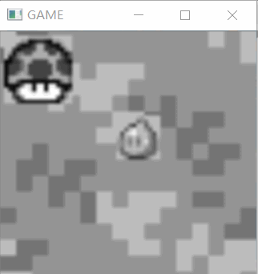
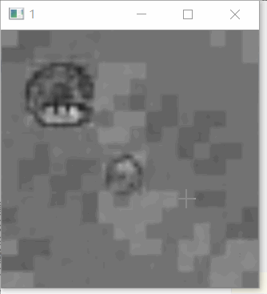
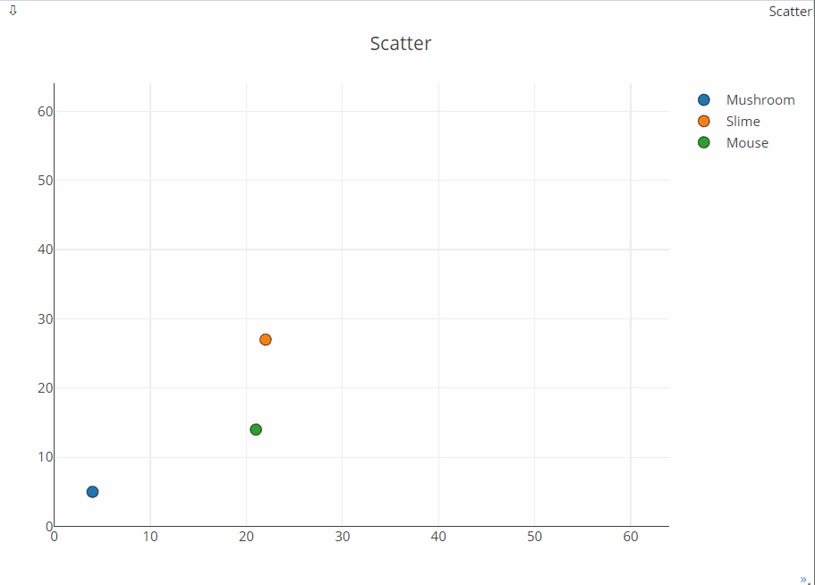

<!--
 * @Author: langelo
 * @Date: 2020-09-30 14:20:02
 * @LastEditTime: 2020-09-30 14:38:29
 * @LastEditors: langelo
 * @Description: 
-->
# GameInNet
Embedding game in Neural Network
## Installation
##### Clone and install requirements
    $ git clone https://github.com/liangzelong/GameInNet.git
    $ cd GameInNet/
    $ sudo pip3 install -r requirements.txt
    $ python GameInNet.py

# MUSHROOM WILL CATCH YOU LITTLE SLIME，RUN!!!!!!
## Target Game

## Generated Game

## Analysis

