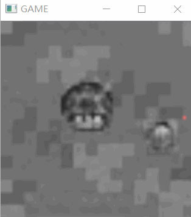
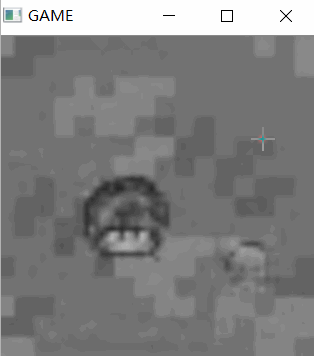

<!--
 * @Author: langelo
 * @Date: 2020-09-30 14:20:02
 * @LastEditTime: 2020-10-12 13:38:43
 * @LastEditors: langelo
 * @Description: 
-->
# GameInNet
Embedding game in Neural Network
## Installation
##### Clone and install requirements
    $ git clone https://github.com/liangzelong/GameInNet.git
    $ cd GameInNet/
    $ sudo pip3 install -r requirements.txt
    $ python GameInNet.py

## Random Mouse Position Test

    $ python ./model/model.py

# MUSHROOM WILL CATCH YOU LITTLE SLIME，RUN!!!!!!
## Target Game

This is our target game: slime escapes from mushroom.

## Generated Game

This is the image we generated.

## Random Mouse Test

Test the program with a random nouse position. Slime will go towards mouse point and mushroom will follow slime. Mouse position is shown with red point.

## Generated Game

Our game works well. Mouse position is shown with red point.

## Analysis the Movement of Entity

This image shows the analysis of the relationship between mushroom's position and slime's position.